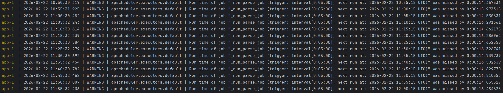

# Отчёт по отладке приложения 
## Исправление ошибок
1. 
   + **Что сделал:** 
Согласно Readme запустил `docker compose up --build`, 
получил ошибку `pydantic_core._pydantic_core.ValidationError`
   + **Проблема:** 
В Pydantic Setting передается что-то лишнее
   + **Файл и строка:** 
[app/core/config.py:14](app/core/config.py#L14)
   + **Как исправил:** 
Передал корректное название переменной окружения `"DATABASE_URL"` вместо `"DATABSE_URL"`

2. 
   + **Что случилось:** 
Запуск бд успешно, запуск сервера успешно, запуск фонового процесса успешно, 
далее - ошибка парсинга `AttributeError: 'NoneType' object has no attribute 'name'`
   + **Файл и строка:** 
[app/services/parser.py:43](app/services/parser.py#L43)
   + **Проблема:** 
Поле `city` может быть `None`, в таком случае `item.city.name.strip()` выкинет ошибку
   + **Решение:** 
Добавлено условие `item.city.name.strip() if item.city is not None else item.city`

3. Наблюдение за логами
   + **Проблема:** 
Слишком частый парсинг вакансий, в логах `trigger: interval[0:00:05]`
   + **Файл и строка:** 
[app/scheduler.py:13](app/scheduler.py#L13)
   + **Решение:** 
Константа `PARSE_SCHEDULE_MINUTES` передается аргументу `seconds`, исправлено на `minutes`, 
в результате в логах `trigger: interval[0:05:00]`

4. Тестирование эндпоинтов
   + **Проблема:** 
Если в POST запросе по адресу `/vacancies` передать вакансию, 
`external_id` которой совпадает с уже имеющейся в базе, эндпоинт вернет ответ в формате JSON и с кодом 200, 
несмотря на то, что в декораторе заданы `response_model=VacancyRead` и `status_code=status.HTTP_201_CREATED`
   + **Файл и строка:** 
[app/api/v1/vacancies.py:52](app/api/v1/vacancies.py#L52)
   + **Решение:** 
Вместо возврата вызов исключения: `raise HTTPException(status_code=status.HTTP_409_CONFLICT, detail='Vacancy already exist')`

5. 
   + **Проблема:** 
Не закрывается клиент парсера, что может привести к утечке соединений
   + **Файл и строка:**
[app/services/parser.py:31](app/services/parser.py#L31)
   + **Исправление:**
Использовать контекстный менеджер при создании соединения
   + **Было:**
`client = httpx.AsyncClient(timeout=timeout)`
   + **Стало:**
`async with httpx.AsyncClient(timeout=timeout) as client: ...`

## Ручной тест приложения

## Итог

