# Отчёт по отладке приложения Кострова Дмитрия Эдуардовича
## Исправление ошибок
1. 
   + **Что сделал:** 
   Согласно Readme запустил `docker compose up --build`, 
   получил ошибку `pydantic_core._pydantic_core.ValidationError`
   + **Проблема:** 
   В Pydantic Setting передается что-то лишнее
   + **Файл и строка:** 
   [app/core/config.py:14](app/core/config.py#L14)
   + **Как исправил:** 
   Передал корректное название переменной окружения `"DATABASE_URL"` вместо `"DATABSE_URL"`
<br><br>
2. 
   + **Что случилось:** 
   Запуск бд успешно, запуск сервера успешно, запуск фонового процесса успешно, 
   далее - ошибка парсинга `AttributeError: 'NoneType' object has no attribute 'name'`
   + **Файл и строка:** 
   [app/services/parser.py:43](app/services/parser.py#L43)
   + **Проблема:** 
   Поле `city` может быть `None`, в таком случае `item.city.name.strip()` выкинет ошибку
   + **Решение:** 
   Добавлено условие `item.city.name.strip() if item.city is not None else item.city`
<br><br>
3.
   + **Проблема:** 
   Слишком частый парсинг вакансий, в логах `trigger: interval[0:00:05]`
   + **Файл и строка:** 
   [app/services/scheduler.py:13](app/services/scheduler.py#L13)
   + **Решение:** 
   Константа `PARSE_SCHEDULE_MINUTES` передается аргументу `seconds`, исправлено на `minutes`, 
   в результате в логах `trigger: interval[0:05:00]`
<br><br>
4. 
   + **Проблема:** 
   Если в POST запросе по адресу `/vacancies` передать вакансию, 
   `external_id` которой совпадает с уже имеющейся в базе, эндпоинт вернет ответ в формате JSON и с кодом 200, 
   несмотря на то, что в декораторе заданы `response_model=VacancyRead` и `status_code=status.HTTP_201_CREATED`
   + **Файл и строка:** 
   [app/api/v1/vacancies.py:51](app/api/v1/vacancies.py#L51)
   + **Решение:** 
   Вместо возврата вызов исключения: `raise HTTPException(status_code=status.HTTP_409_CONFLICT, detail='Vacancy already exist')`
<br><br>
5. 
   + **Проблема:** 
   Не закрывается клиент парсера, что может привести к утечке соединений
   + **Файл и строка:**
   [app/services/parser.py:31](app/services/parser.py#L31)
   + **Исправление:**
   Использовать контекстный менеджер при создании соединения
   + **Было:**
   `client = httpx.AsyncClient(timeout=timeout)`
   + **Стало:**
   `async with httpx.AsyncClient(timeout=timeout) as client: ...`
<br><br>
6. 
   + **Проблема:** 
   В функции `upsert_external_vacancies()` сначала идет запрос к базе для проверки существования вакансии,
   если существует, записывает ее `external_id` в `existing_ids`, далее происходит обновление или добавление. 
   Если между этой проверкой и обновлением полей вакансии она будет удалена, `result.scalar_one()` выбросит исключение 
   `sqlalchemy.exc.NoResultFound`
   + **Файл и строка:**
      [app/crud/vacancy.py:81](app/crud/vacancy.py#L81)
   + **Воспроизведение ошибки:**
     1. Добавил await asyncio.sleep(10) перед циклом обновления (после получения existing_ids)
     2. Запустил приложение и вызвал парсинг
     3. В логах увидел "timer start"
     4. Через Swagger удалил вакансию с id=25 (которая была в existing_ids)
     5. Через 10 секунд код продолжил выполнение и упал с NoResultFound
   + **Лог:**
   ```
   app-1  | 2026-02-22 19:46:33,195 | CRITICAL | root | timer start                                                                                               
   app-1  | INFO:     172.18.0.1:52894 - "DELETE /api/v1/vacancies/25 HTTP/1.1" 204 No Content
   app-1  | INFO:     172.18.0.1:52880 - "POST /api/v1/parse/ HTTP/1.1" 500 Internal Server Error  
   ...
   app-1  | sqlalchemy.exc.NoResultFound: No row was found when one was required
   ```
   + **Решение:**
   ```
   vacancy = result.scalar_one_or_none()  # вместо result.scalar_one()
   if vacancy is None:                    # дополнительная проверка на None
       session.add(Vacancy(**payload))    # создание новой вакансии
       created_count += 1
       continue                           # обновление не произойдет
   ```
## Контрольный тест
1. Приложение запускается успешно, база данных доступна, api принимает запросы
2. Парсинг работает без падений 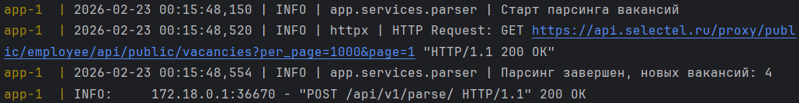
3. Корректная работа всех эндпоинтов обеспечена
   + GET /api/v1/vacancies/
      - Без параметров:

      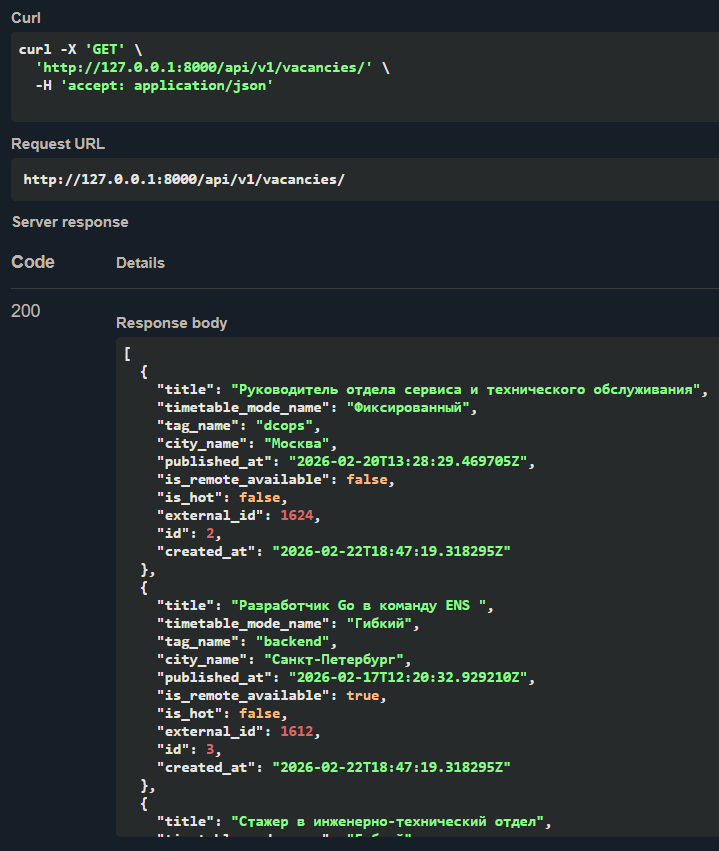

      - С параметрами: 

      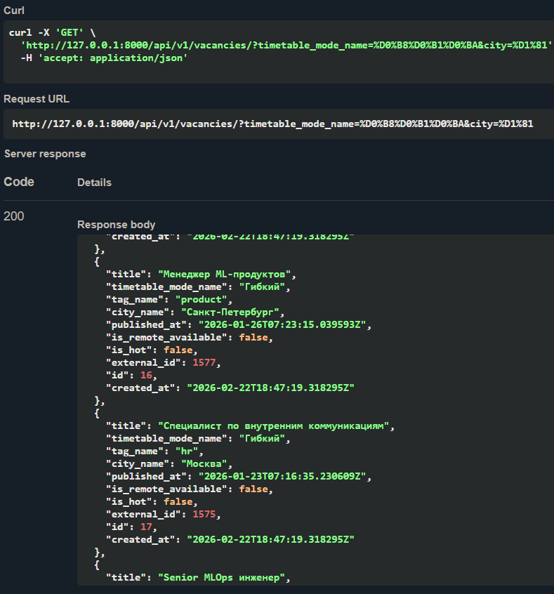

   + GET /api/v1/vacancies/{vacancy_id}
      - Существующий id

      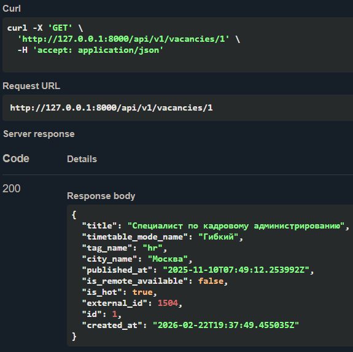

      - Несуществующий id

      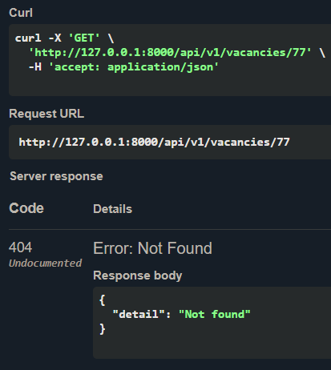

   + POST /api/v1/vacancies/
      - Вакансии с указанным `external_id` нет в базе

      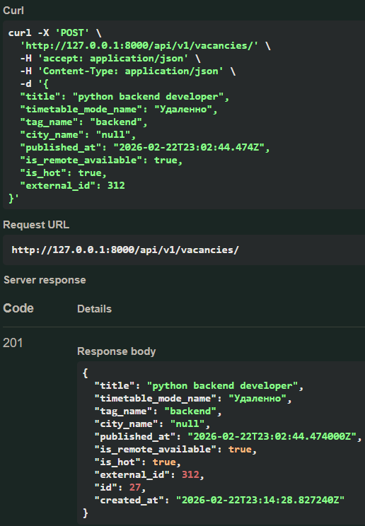

      - Вакансия с указанным `external_id` есть в базе

      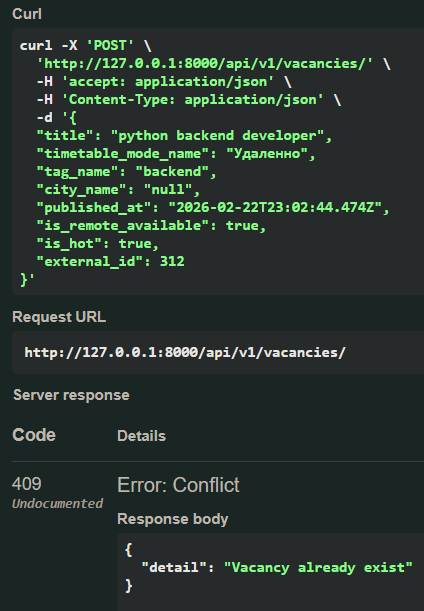

   + PUT /api/v1/vacancies/{vacancy_id}
      - Указан существующий `id`

      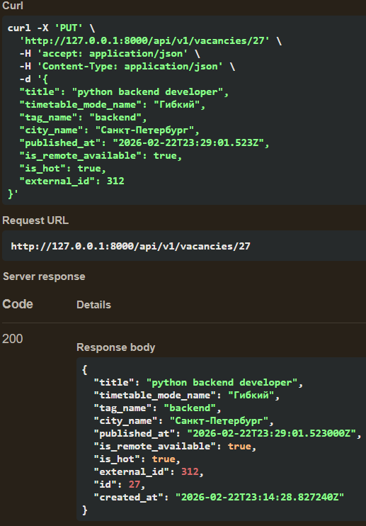

      - Указан несуществующий `id`

      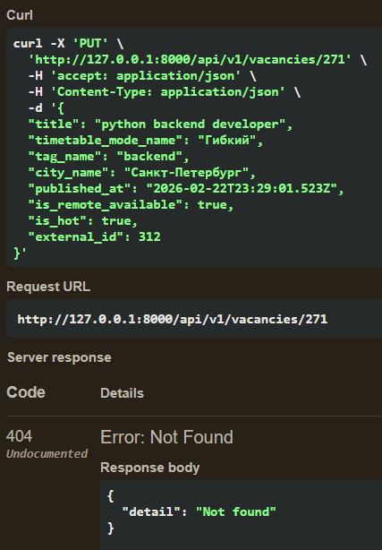

   + DELETE /api/v1/vacancies/{vacancy_id}
      - Указан существующий `id`

      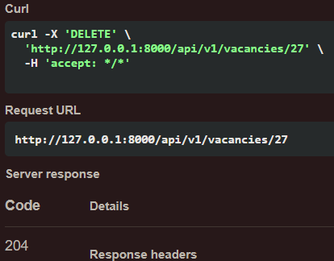

      - Указан несуществующий `id`

      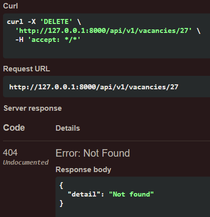

   + POST /api/v1/parse/

   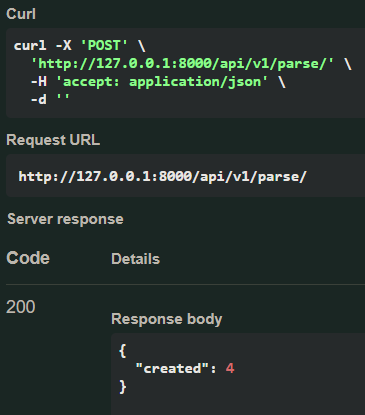
4. Фоновая задача парсинга работает по заявленному расписанию
   

## Итог
* Найдено 6 из 8 багов
* Все эндпоинты работают корректно
* Приложение возвращает корректные HTTP-статусы и данные
* Приложены скриншоты Swagger UI с выполненными успешными
запросами
